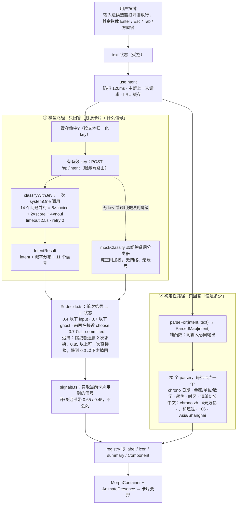

# 中文支持 · Chinese (zh-CN)

这个 fork 让 Shapeshift 真正**用中文可用**。上游是纯英文/印度语境的实现，中文输入不会报错，只会静默失效——不出现卡片、金额变成 `₹`、时区算错 14 小时。本分支修掉了这些。

## 快速开始

```bash
bun install
bun dev            # 默认就是中文界面
```

界面语言是**构建期常量**，默认中文：

```bash
NEXT_PUBLIC_LOCALE=en bun dev   # 切回英文界面（英文输入解析始终可用）
```

不配 `TYPESAFE_API_KEY` 时走内置的离线分类器（`jev-offline`），中文照样可用。

## 关键实现流程图

一次按键发生了什么。核心是**两条路径读同一段文本**：模型只回答「是哪张卡片 + 什么信号」，代码回答「值是多少」，两者在渲染层合流。



也可以看高保真版（可缩放 SVG）：[docs/zh-CN-flow.svg](zh-CN-flow.svg)。

三条设计原则：**流程由代码掌握**（模型只给带类型的常识判断）；**一次请求问 14 个问题**（speculative fan-out，省往返、延迟可预测）；**两级降级**（没 key 走离线分类器，单次调用失败当次回落离线，界面永不闪烁）。

## 改了什么

### 1. 输入法（IME）不再被劫持

改造前 `onKeyDown` 对 `Enter`/`Escape`/`Tab`/方向键无条件 `preventDefault()`，且全仓库没有任何 `isComposing` 处理。用拼音输入法时，**按 Enter 确认候选词会把半成品提交成卡片**，按 Esc 会清空输入框。

现在 `Shapeshift.tsx` 在候选窗打开期间（`composing` ref、`onCompositionStart/End`、`e.nativeEvent.isComposing`、`keyCode === 229`）直接放行，按键交还给输入法。

### 2. 离线分类器支持中文

这是最要命的一处。原实现用 `t.split(/\s+/)` 的长度当"内容量"用；中文没有空格，整句话就是"1 个词"，于是命中 `words.length === 1 && !num` 被判定为 `none`。

> 实测（同一段离线逻辑，17 条中文样例，得到 `committed` 卡片才算命中）：
> **改造前 1/17 → 改造后 17/17**

现在长度按 `拉丁词数 + 汉字数/3` 计算（英文权重与改造前逐位一致，所以英文 172 个测试全绿），并为 43 条意图规则、34 条信号规则补齐了中文关键词。

### 3. 中文日期 / 金额 / 单位 / 时区

| 能力 | 改造前 | 现在 |
|---|---|---|
| 日期 | 仅英文（chrono 默认 en） | 接 `chrono.zh`，补 后天/大后天/周末，并**跨引擎合并** `明天 3pm` |
| 金额 | 只认 `₹ $ € £`，`DEFAULT_CURRENCY = "₹"` | 认 `¥ ￥ 元 块 人民币 CNY RMB`，支持 `万/亿`；中文输入无符号时默认 ¥ |
| 列表 | 只按 `, ; & and` 切分 | `、，；和跟与以及`；`买牛奶、鸡蛋、面包和咖啡` → 4 项 |
| 单位 | 75 个英文别名 | 补中文别名，`斤`(500g)/`两`(50g) 走克换算 |
| 时区 | **无任何中国大陆时区**；`cst` → 芝加哥 | 北京/上海/深圳/广州/杭州/成都 → `Asia/Shanghai`；`cst` 在中文语境下是中国标准时间 |
| 手机号 | 印度正则，中国号**永不匹配** | `1[3-9]\d{9}` → `+86 138 0013 8000` |
| 节假日 | 印度国庆日 | 元旦/春节/除夕/元宵/清明/劳动节/端午/中秋/国庆/双十一（含 2024–2031 农历表） |
| 颜色 | 140 个英文名，`\b` 边界对汉字无效 | 中文色名（最长匹配优先）+ 浅/深/亮/灰 修饰词 |
| 会议 | 只有 Zoom/Meet/Teams | 腾讯会议/飞书/钉钉/企业微信/微信 |
| 链接 | 无 `.cn` | 补 `cn / com.cn / top / site / tech` |
| 标点 | 只认半角 | 全角 `，、。！？％` 与全角数字全部归一化 |

### 4. 界面中文化

约 330 / 361 条用户可见文案已本地化（卡片名、按钮、占位符、提示、元数据、OG 图），19 张卡片的示例改成了真正能解析的中文输入。另外：

- **字体**：`--font-sans` 在 Geist 之后回退到 `PingFang SC / Hiragino Sans GB / Microsoft YaHei / Noto Sans SC`，拉丁字形仍用 Geist 度量。
- **时间**：`今天 / 明天 / 周一 / 15:00`（24 小时制）；修掉了 `GoalCard` 里印度数字分组 `en-IN` 的 bug。
- **日历**：`react-day-picker` 的 `zhCN` 接入 EventCard 与 TravelCard（上游接受了 `locale` prop 但两处调用都没传）。
- **`lang="zh-CN"`** 与 `openGraph.locale` 跟随构建 locale。

### 5. Jev 提问是中英双语

`questions.ts` 的 14 个问题 + 64 条 criteria 现在是「英文 / 中文」。**英文原文完整保留**——实测 `jev-1.13.0` 用英文 criteria 也能 12/12 正确识别中文输入，英文才是主 criteria，中文是增强。

## 一处刻意保留的不一致

`parse/timezone.ts` 的 `formatIn()` 仍是 `en-US` 12 小时制（`"3:00 PM"`），因为既有测试把它钉死了。中文的 24 小时表盘由 `display.ts` 的 `formatZoneTime()` 提供，卡片与摘要共用它，所以展示层是一致的。

## 验证

```bash
bun test                              # 298 pass / 0 fail
NEXT_PUBLIC_LOCALE=en bun test        # 298 pass / 0 fail（英文路径同样全绿）
bun run typecheck && bun run lint
bun run build
```

测试覆盖：原有 172 个英文测试一个没动；新增 `zh-parse` / `zh-mock` / `zh-golden` / `i18n` 四个文件，共 126 个中文用例，含 17 条 golden set 样例同时验证「分类层 + 解析层」。

## 已知缺口

- 约 30 条低频文案未本地化（`?debug=1` 面板的英文诊断输出等）。
- `IntentPalette` 的 cmdk 索引没有拼音路径，中文只能按汉字搜。
- `?debug=1` 面板、部分 parser 回显词（如 `Every morning`）跟随**输入语言**而非界面语言。
- 完整的运行时语言切换（无需重新构建）需要 provider + hydration 处理，本分支刻意不做，以保持按键路径零开销。

MIT，与上游一致。
